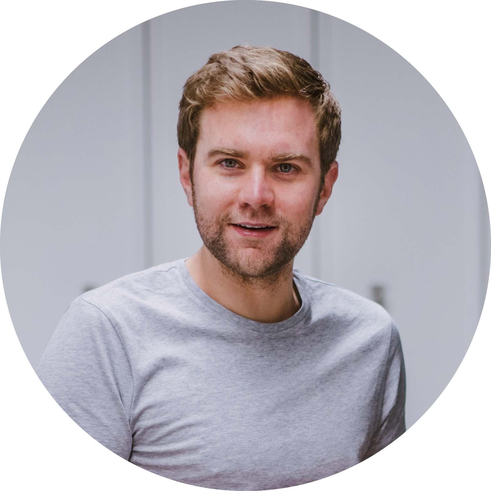

 
 <table style="width:100%">
  <tr>
    <td></td>
    <td style='text-align: left;;vertical-align: text-top;padding-left:3em'>
    <b>Michael Lutter</b>  
    <b>Contact:</b> mail(at)mlutter.eu  
    <b>Twitter:</b> <a href="https://twitter.com/_mlutter">_mlutter</a>   
      
    <b>Research Interests:</b> 
     Model-Based Reinforcement Learning, 
     Interpretable and Plausible Models, 
     High-Speed Robot Control,
     Dexterous Manipulation,
     Robust Control
    </td>
  </tr>
</table> 
 

 
<b>Bio:</b> Michael Lutter is a Ph.D. student with <a href="https://www.ias.informatik.tu-darmstadt.de/Team/JanPeters">Jan Peters</a> 
at the <a href="https://www.ias.informatik.tu-darmstadt.de/">Institute for Intelligent 
Autonomous Systems (IAS) TU Darmstadt</a> since July 2017. During his Ph.D., he researched inductive biases for robot
learning. Michael also worked with ABB Corporate Research on a joint research project
to evaluate the application of robot learning to industrial applications. He completed a research internship at DeepMind, NVIDIA Research
and received multiple awards for his research including the 
<a href="https://ki50.de/ki-newcomer/">AI newcomer award (2019)</a>  
of the German computer science foundation and  was 
<a href="https://blogs.nvidia.com/blog/2020/02/17/nvidia-phd-fellowships-gpu-computing-research/">NVIDIA graduate fellowship finalist (2019)</a>.     

Prior to this Michael held a researcher position at the Technical University of Munich (TUM) for bio-inspired learning 
for robotics. During this time he worked for the Neurorobotics subproject of the 
<a href="https://www.humanbrainproject.eu/en/">Human Brain Project</a>, a European H2020 FET flagship project. In 
addition, he taught the classes "Deep Learning for Autonomous Systems” and  “Fundamentals of Computer Science for 
Neuroengineering” within the <a href="http://www.msne.ei.tum.de/en/home/">Elite Master Programm Neuroengineering</a> 
and participated in teaching <a href="https://www.thinkmakestart.com/">Think. Make. Start.</a>, a two-week prototyping course. 
His educational background covers a Bachelors in Engineering Management from University of Duisburg Essen and a Masters 
in Electrical Engineering from the Technical University of Munich. During his undergraduate studies he also spent one 
semester at the Massachusetts Institute of Technology studying electrical engineering and computer science. In addition 
to his studies, Michael worked for ThyssenKrupp, Siemens and General Electric and received multiple scholarships for 
academic excellence.

# News
* <b>(10.May 21)</b> - Accepted RSS Paper Robust Value Iteration for Continuous Control <a href="https://arxiv.org/pdf/2105.12189.pdf">[Arxiv]</a>
* <b>(08.May 21)</b> - Accepted ICML Paper Value Iteration in continuous space and time <a href="https://arxiv.org/pdf/2105.04682.pdf">[Arxiv]</a>
* <b>(01.Apr 21)</b> - Accepted ICRA Paper Model-Learning for offline RL <a href="https://arxiv.org/abs/2011.01734">[Arxiv]</a>
* <b>(14.Jan 21)</b> - Started my Research Internship with the DeepMind Robotics Team
* <b>(11.Dec 20)</b> - Organizing NeurIPS WS on <a href="https://inductive-biases.github.io/">Inductive Biases and Physically Structured Learning</a>
* <b>(25.Oct 20)</b> - Invited Talk IROS WS on <a href="http://www.iros-ar2020.lissi.fr/doku.php/start">Trends and Advances in ML and Automated Reasoning</a>
* <b>(14.Oct 20)</b> - Robot Juggling paper accepted at CoRL 2020  <a href="https://arxiv.org/abs/2010.13483">[Arxiv]</a>
* <b>(01.Oct 20)</b> - My Homepage is finally live :)

