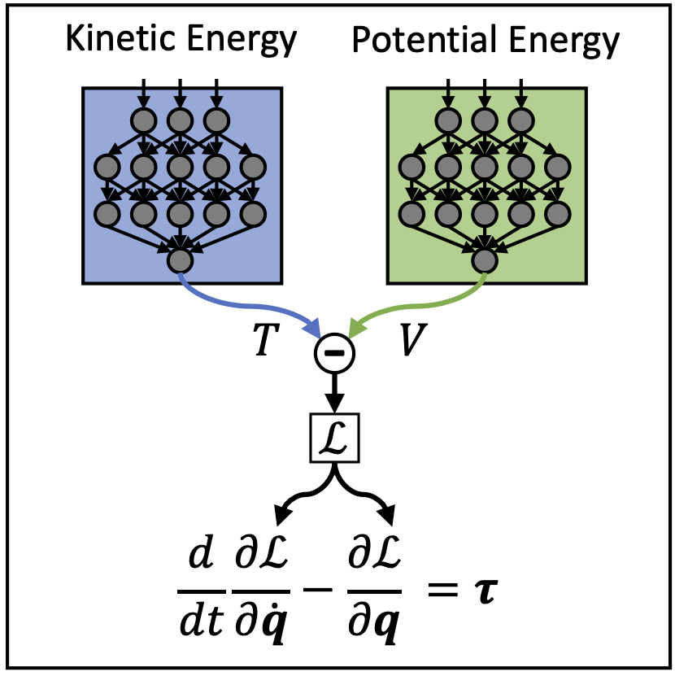

... Under construction, text, images and videos coming soon ...

I work on inductive biases for robot learning. Within this field I focus on whether inductive biases are preferable for 
learning algorithms and how inductive biases
can be incorporated in generic deep learning algorithms. I showed that (1) inductive biases can drastically improve sample
efficiency for robot learning and (2) that generic inductive biases can be incorporated in deep learning models to obtain
interpretable and physically plausible models. 

A full list of all publications can be found at [Google Scholar](https://scholar.google.com/citations?user=Wvdo5bYAAAAJ&hl=en)

### Deep Lagrangian Networks (DeLaN)

Deep Lagrangian Networks (DeLaN) combines deep networks with Lagrangian mechanics to learn dynamics 
models that conserve energy. DeLaN uses two deep networks to represent the potential and kinetic energy of the system. 
These networks are combined to approximate the Lagrangian. The forward and inverse model of the system can be computed 
using the approximated Lagrangian and the Euler-Lagrange differential equation. DeLaN learns the system energy 
unsupervised by minimizing the squared residual of the Euler-Lagrange equation. The resulting models retain many 
advantages of classical system identification techniques but do not require any specific knowledge of the individual 
system. DeLaN conserves energy, enables energy control, and is interpretable, i.e., can be used to compute Coriolis 
force, gravitational force, generalized momentum, and other physical quantities. The learned DeLaN models can be used 
for real-time control of simulated and physical rigid body systems. Compared to standard deep networks, the 
physics-inspired models learn better models and capture the underlying structure of the dynamics. DeLaN models also
enable energy control and successfully swing up the under-actuated Furuta pendulum and the cartpole. Previously, 
this energy control was not possible using black-box model learning approaches as these cannot learn the energy.

**Paper:**
* **Lutter, M.**; Peters, J. (2021). 
Combining Physics and Deep Learning to learn Continuous-Time Dynamics Models, 
Arxiv Preprint Arxiv:2110.01894
[[**Arxiv**]](https://arxiv.org/abs/2110.01894)

* **Lutter, M.**; Ritter, C.; Peters, J. (2019). 
Deep Lagrangian Networks: Using Physics as Model Prior for Deep Learning, 
International Conference on Learning Representations (ICLR).
[[**Arxiv**]](https://arxiv.org/abs/1907.04490)

* **Lutter, M.**; Peters, J. (2019). 
Deep Lagrangian Networks for end-to-end learning of energy-based control for under-actuated systems, 
International Conference on Intelligent Robots and Systems (IROS).
[[**Arxiv**]](https://arxiv.org/abs/1907.04489) [[**Code**]](https://git.ias.informatik.tu-darmstadt.de/lutter/deep_lagrangian_networks)

### Continuous Time Value Iteration
**Paper:**
* **Lutter, M.**; Mannor, S.; Fox, D.; Garg, A.;  Peters, J. (2021). 
Continuous-Time Fitted Value Iteration for Robust Policies, 
Arxiv Preprint Arxiv:2110.01954
[[**Arxiv**]](https://arxiv.org/abs/2110.01954)
 
* **Lutter, M.**; Mannor, S.; Peters, J.; Fox, D.; Garg, A. (2021). 
Robust Value Iteration for Continuous Control Tasks,
Robotics: Science and Systems (RSS)
[[**Arxiv**]](https://arxiv.org/abs/2105.12189)

* **Lutter, M.**; Mannor, S.; Peters, J.; Fox, D.; Garg, A. (2021).
Value Iteration in Continuous Actions, States and Time,
International Conference on Machine Learning (ICML) 
[[**Arxiv**]](https://arxiv.org/abs/2105.04682)

* **Lutter, M.**; Belousov, B.; Listmann, K.; Clever, D.; Peters, J. (2019). 
HJB Optimal Feedback Control with Deep Differential Value Functions and Action Constraints, 
Conference on Robot Learning (CoRL)
[[**Arxiv**]](https://arxiv.org/abs/1909.06153)

### Differentiable Newton-Euler-Algorithms
**Paper:**
* **Lutter, M.**\*; Silberbauer, J.\*; Watson, J.; Peters, J. (2020). 
A Differentiable Newton Euler Algorithm for Multi-body Model Learning,
ICML Workshop on Inductive Biases, Invariances and Generalization in RL
[[**Arxiv**]](https://arxiv.org/abs/2010.09802)

* **Lutter, M.**\*; Silberbauer, J.\*; Watson, J.; Peters, J. (2020). 
Differentiable Physics Models for Real-world Offline Model-based Reinforcement Learning,
International Conference on Robotics and Automation (ICRA)
[[**Arxiv**]](https://arxiv.org/abs/2011.01734) [[**Videos**]](https://sites.google.com/view/ball-in-a-cup-in-4-minutes/)

### Robot Juggling 
**Paper:**
* Ploeger, K.\*; **Lutter, M.**\*; Peters, J. (2020). 
High Acceleration Reinforcement Learning for Real-World Juggling with Binary Rewards, 
Conference on Robot Learning (CoRL). [[**Arxiv**]](https://arxiv.org/abs/2010.13483) [[**Videos**]](https://sites.google.com/view/jugglingbot)